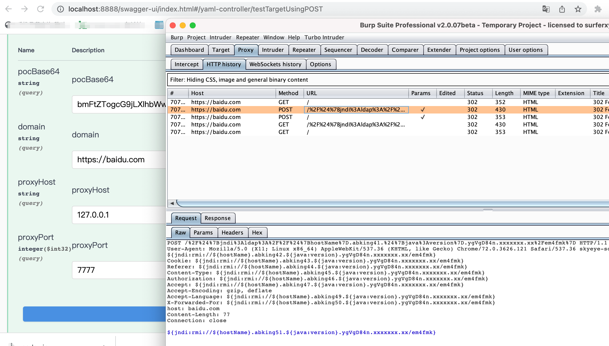

# 飞鲨扫描器
小米在去年进行了黑盒扫描器的引擎重构，原有的Python引擎出现太多问题
1. 经常出现任务卡死等情况
2. PoC和引擎的耦合太严重
3. 引入过多依赖，导致稳定性下降
4. 请求日志记录不全
5. PoC编写不规范

于是，在去年Q3季度，我们完成了Python引擎到Go引擎的切换，PoC格式参考了xray的YAML格式的PoC（由于当时是xray还是v1版本的PoC，所以我们的黑盒扫描器也只是参考了v1的格式）
经过将近一年的落地使用，效果很好
1. 几乎没有再出现任务卡死的情况，可用性99.9%
2. PoC和引擎解耦
3. HTTP协议的请求不需要引入依赖，非HTTP协议的PoC让研发实现，弱密码类型的PoC只需要运营配置爆破字典
4. 精准控制每一个请求，所以日志可以全部记录
5. YAML格式明了，PoC编写规范
6. 增加了xray不支持的一些语法

这对于小米的黑盒扫描器来说，是里程碑式的成果

我利用业余时间也完成了一个类似功能的扫描器项目——flyshark ，由于个人语言习惯原因，所以最终采用了java完成了本项目
由于语言的不同，我为了兼容公司的PoC，在一些细节的实现上面还是存在许多难度的，比如Go解析表达式，使用的是google的通用表达式语言（https://github.com/google/cel-spec）
本项目解析表达式采用的是Spring framework的SpEL，它并不兼容cel-spec里面的一些语法，比如没有in关键字，比如没有一些函数
因此我对SpEL进行了修改，还贡献了一个commit，这也是个很有意思的经历。(https://github.com/spring-projects/spring-framework/pull/27714)
## 架构
本仓库是一个阉割版本的worker。 完整项目是一个Server端，多个worker端，使用RocketMQ进行消息的生产和消费，支持worker的无限水平扩展，由于公司的容器化做得很好，项目还实现了全容器化部署。以后会考虑全部开源。
- 使用SpringBoot框架 ，改写了其中的SpEL部分，增加了一些功能，比如字节字面量，关键字和一些函数
- 使用了netty进行发包，选型了多个网络IO框架，均无法支持畸形的HTTP请求包，比如SpringBoot自带的RestTemplate和Spring Webflux
- 使用MySQL进行数据的存储和关联，包括任务和资产，任务和PoC的关联
- 使用vue-element-admin作为前端，控制任务、PoC等模块的CRUD操作
## 使用
常规SpringBoot项目，FlysharkApplication类main方法启动，访问
http://localhost:8888/swagger-ui/index.html
yaml-controller的testTarget方法，传入参数即可
- pocBase64为base64编码之后的poc，poc样例可以参考仓库根目录下的poc.yaml(Log4j2远程命令执行)
- domain为URL链接，例如：http://baidu.com
- 配置proxyHost和proxyPort为burp的代理，可以看到流量，不传这两个参数即为不代理流量

#### 注意
尽管已经支持了dnslog的漏洞检测，但是由于使用的是内部自建的dnslog平台，不适合拿出来开源使用，因此本仓库中对于reverse.wait(5)的逻辑恒为false，请自行修改

开源以供交流
